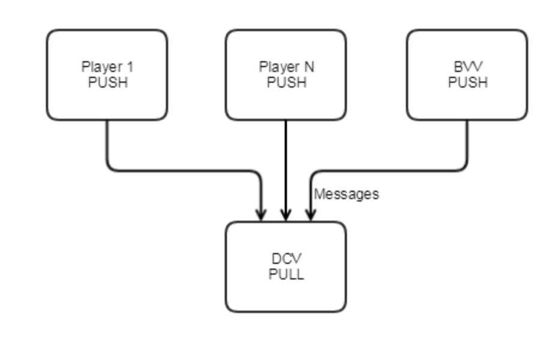
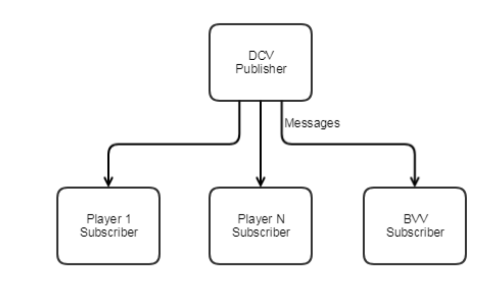

# Pangea-Bet

The aim of this project is to provide the necessary bet API's which are sufficient to play poker from the command line. The initial draft of the game written by jl777 is [here](./docs/BET_Initial_Draft.md).

Bet is the implementation of the Pangea protocol which nees LN and CHIPS. The installation of [LN](https://github.com/chips-blockchain/lightning) and [CHIPS](https://github.com/chips-blockchain/chips) must be done before proceeding to play with bet.

If you would like to learn more please refer to the [Pangea Protocol Whitepaper](https://cdn.discordapp.com/attachments/455737840668770315/456036359870611457/Unsolicited_PANGEA_WP.pdf)

## The game

### Terms

`CHIPS` - game token and the name of the poker project

`DCV` - Deck Creating Vendor, the Dealer node

`BVV` - Blinding Value Vendor, the component that helps securely shuffle the deck

`Cashier` or `Notary` nodes - Trusted nodes in the network that are elcted and chosen by the community. The set of trusted nodes at the moment are [here](https://github.com/chips-blockchain/bet/blob/master/privatebet/config/cashier_nodes.json).

### Node Communication

All the communication in the game must happen though `DCV`. Pangea Protocol does not allow any direct communication between the Players and the `BVV`. Players and `BVV` connect to `DCV` via `NN_PUSH/NN_PULL` socket. If any entity in the game is willing to send a message, it sends it to `DCV` via `NN_PUSH`, and `DCV` receives it via `NN_PULL`.



Once the `DCV` receives the messages it publishes it via `NN_PUB` and since Players and `BVV` are subscribed to `DCV` via `NN_SUB` so whenever the `DCV` publishes messages the Players and `BVV` receive it.



Source: Pangea Protocol Whitepaper (authors: [sg777](https://github.com/sg777), [jl777](https://github.com/jl777/))


## Installation

> Note: You will need an exposed IP to play the game

### Ports to be used and open

Below are the list of the ports used and should be remained open incase if you have any firewall configurations.
```
* 7797 - This port is used to have pub-sub communication between Dealer and player nodes.
* 7798 - This port is used to have pull-push communication between Dealer and player nodes.
* 7901 - This port is used to have pub-sub communication between Cashier and any other{player,dealer} nodes.
* 7902 - This port is used to have push-pull communication between Cashier and any other{player,dealer} nodes.
* 9000 - This port is used to have websocket communication between GUI and {player,dealer} nodes.
```

### Compilation Guidelines

Steps to compile this repo is mentioned in [compile.md](./compile.md). 

### Docker Setup

The node set up can also be done [using Docker](https://github.com/chips-blockchain/docker).

## Running the game

### Command to run DCV
```
$ cd ~/bet/privatebet
$ ./bet dcv <dealer_ip>
```
The `dealer_ip` should be a `static public ip` of a machine on which a dealer node runs.

#### Configuring the Table

The dealer can configure the table parameters, the steps to configure the table parameters are mentioned [here](./configure_dealer.md).

### Command to run Player

```
$ cd
$ cd bet/privatebet
$ ./bet player
```

### Command to run Cashier

```
$ cd
$ cd bet/privatebet
$ ./cashierd cashier cashier_ip
```
The `cashier_ip` should be a `static public ip` of a machine on which a cashier node runs. The cashier nodes are the trusted nodes in the network and are elcted and chosen by the community. The set of trusted nodes at the moment are [here](./privatebet/config/cashier_nodes.json).

To avoid the unavailability of the nodes due to any crahing and disconnections, the cashier daemons are scheduled using crontab. The contents of the shell script which is scheduled using the crontab is as follows:
```
#!/bin/bash
SERVICE="cashierd"
date
if pgrep -x "$SERVICE" >/dev/null
then
    echo "$SERVICE is running"
else
    echo "$SERVICE stopped"
    cd /root/bet/privatebet
    ./cashierd cashier <ip_addr>
fi
```
Using `crontab -e` one can edit the crontab file and schedule it run all the time by adding the following line at the end of cron file <br/>`* * * * * /root/cron.sh`.<br/> Here `cron.sh` contains the above shell commands and replace `<ip_addr>` with the static public ipv4 address of the node where this daemon is running.

The detailed description of the cashier protocol is mentioned [here](./cashier_protocol.md).

## Usage of this repo

The usage of this repo varies from branch to branch. Each branch has a different gaming logic and their intended gameplays are different.

The branches are listes as follow.
* master
* highest_card_wins
* poker
* mp_cli
* rest_dev
* poker_test

### master
The implementation of poker using the GUI has been implemented here.

### highest_card_wins
This branch is used to play the highest card player wins game via CLI, two players can play the game. The player whoever gets the highest card wins the game.

### poker
This branch is used to player poker via CLI

### mp_cli
In this branch implementation is done to support more than two players, and also made a provision to pass the number of players from the command line

### rest_dev
This branch is used to player poker via GUI, the GUI code should be taken from `poker` branch of `[pangea-poker-frontend](https://github.com/sg777/pangea-poker-frontend)` repo.

For the GUI developers the backend message formats are defined [here](./docs/messageFormats.md)

### poker_test
This branch is used to player poker via GUI, the GUI code should be taken from `poker_test` branch of `[pangea-poker-frontend](https://github.com/sg777/pangea-poker-frontend)` repo.

### LN Upgrade
Since bet uses the lightning network for the real time payments, so its necessary for the CHIPS LN node to be sync with upstream lightning network. As we seen the changes in the input and output of LN API's in the upstream we should be cautious about porting those changes into the CHIPS LN node. 
The LN commands that bet uses at the moment during the process of the game are listed below:
```
getinfo
fundchannel
pay
connect
listfunds
invoice
dev-blockheight
peer-channel-state
listpeers
newaddr
```
So we should test the functiolities of these API's to see any changes are made everytime when we port something to the downstream CHIPS LN node.
