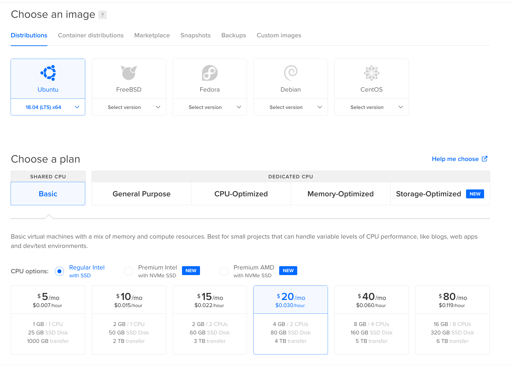
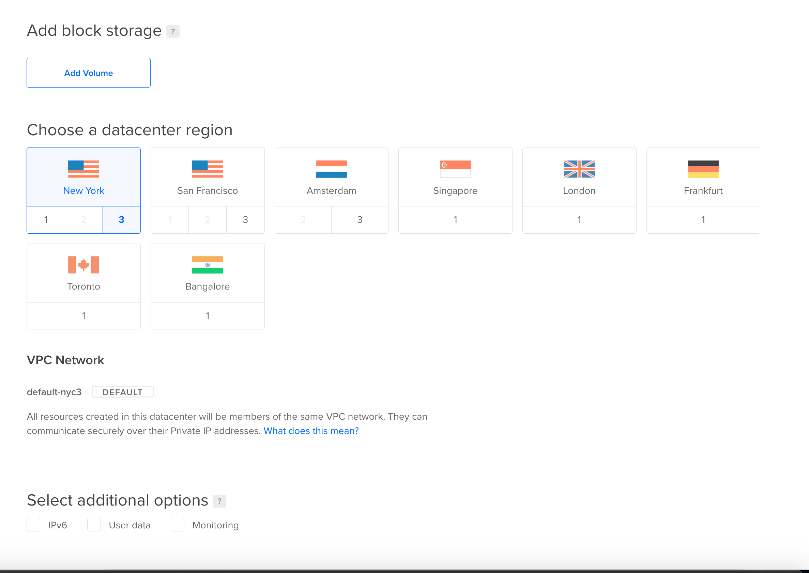
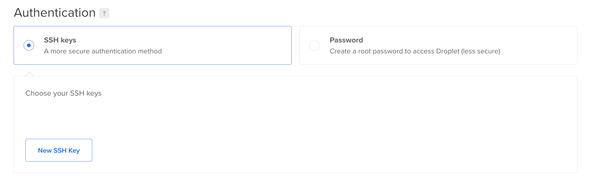

# Server setup for the backend


_Please be aware this setup is a temporary measure while we are working on an easy to run installation. We intend to totally decentralise so it will not be required to use a centralised hosting at all._

This example uses Digital Ocean. 

You can sign up to Digital Ocean using this link - https://m.do.co/c/9492bae9fc3c It is a referral link and if you use it, it will give you $100 Digital Ocean credit for 60 days. The droplet we are creating here is $20 per month so you can have two free months of poker setup and plus you can experiment with Digital Ocean some more to use the rest of the credit. I in return will receive $25 and that will pay for my CHIPS server for the month.

For this tutorial we are going to setup a droplet with the following configuration:

- Ubuntu 18.04 x 64
- RAM: 4GB
- SSD: 80GB


## Digital Ocean
You need to register on Digital Ocean and once you are through and have your panel open choose Create a droplet.


### 1. Create a droplet


### 2. Choose Distribution - Ubuntu 18.04 or Ubuntu 20.04 and choose a plan




### 3. Choose any datacenter you want, it does not really matter.




### 4. Add your SSH keys




### 5. Click Create Droplet
Wait for your droplet to be created. Once done, copy your IP and open terminal on your computer. The rest of the setup will happen in terminal.


### 6. Initial server setup

Part of the following tutorial is enabling firewall, while doing so be aware that you need to make sure the following ports are open.

```
* 7797 - This port is used to have pub-sub communication between Dealer and player nodes.
* 7798 - This port is used to have pull-push communication between Dealer and player nodes.
* 7901 - This port is used to have pub-sub communication between Cashier and any other{player,dealer} nodes.
* 7902 - This port is used to have push-pull communication between Cashier and any other{player,dealer} nodes.
* 9000 - This port is used to have websocket communication between GUI and {player,dealer} nodes.
```


Follow [The initial server setup tutorial](https://www.digitalocean.com/community/tutorials/initial-server-setup-with-ubuntu-18-04)
