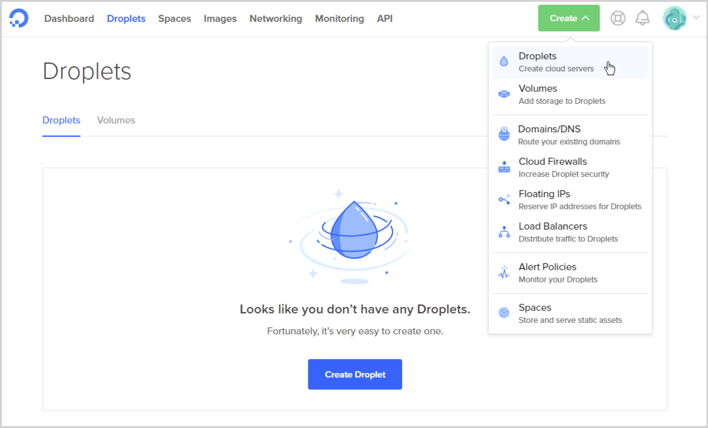

# Server setup for the backend

*
* Please be aware this setup is a temporary measure while we are working on an easy to run installation, which will also support decentalization.
*
* 

This example uses Digital Ocean. 

You can sign up to Digital Ocean using this link - https://m.do.co/c/9492bae9fc3c It is a referral link and if you use it, it will give you $100 Digital Ocean credit and considering the droplet you need for this setup is about $20 per month you can have 5 free months. I in return will receive $25 and that will pay for my CHIPS server for the month.

For this tutorial we are going to setup a droplet with the following configuration:
Ubuntu 18.04 x 64
RAM: 4GB
SSD: 80GB

You need to register on Digital Ocean and once you are through and have your panel open choose Create a droplet.

Follow this initial server setup tutorial ( https://www.digitalocean.com/community/tutorials/initial-server-setup-with-ubuntu-18-04)