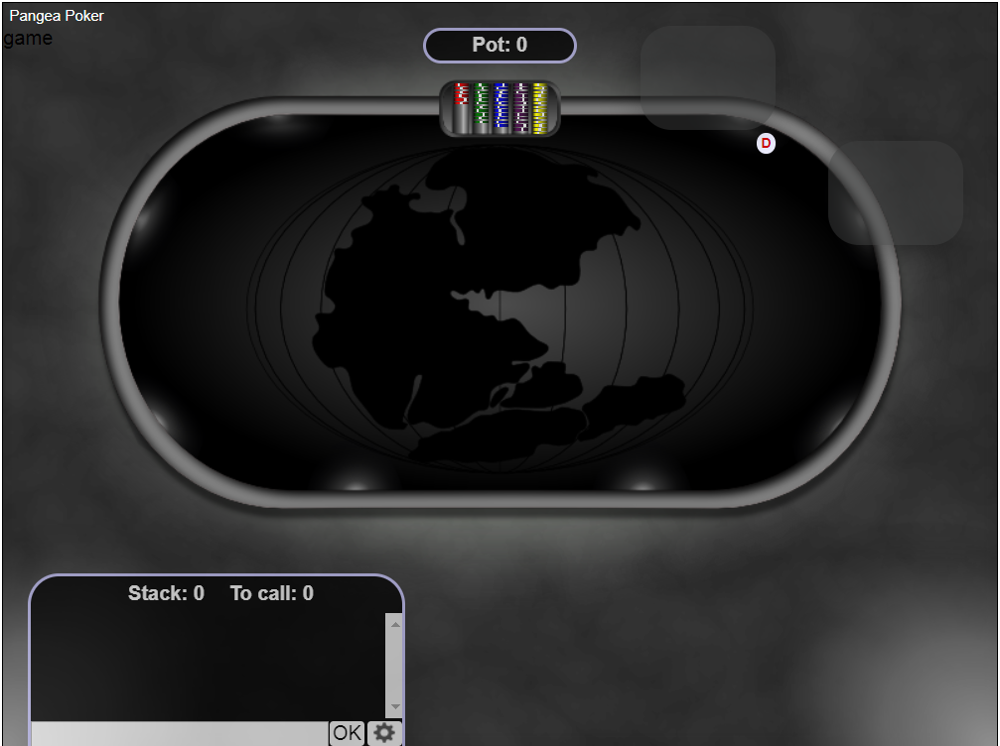

Here we see the game flow along with message formats that are part of it. Below we dive into understanding the message formats we need to understand the entities in the gaming.

As we know, Pangea is a protocol which defines how the deck needs to be presented, shuffled, distrinuted among the players using the supporting entities `DCV (Deck Creating Vendor)` and `BVV (Blinding Value Vendor)`.

`BVV` nodes can be any set of the trsuted nodes, say here notary nodes can act like `BVV` nodes. Which can take part in deck shuffling, distributing and resolving the payment disputes.

`DCV` can act like a dealer node, where the GUI is cnfigured in the node and the players can access it via the dealer's IP like mentioned below. `DCV` also takes part in deck shuffling and distribution.

How the playing nodes need to be set up in the backend is very important in order for the player to start playing. First thing is every player who wants to play using Pangea they need to set up the bet node.

Detailed instructions on how to setup the bet node is mentioned [here](../README.md#Steps-to-compile). Once the node is setup in order to play, the player must need funds, here `CHIPS` is cryptocurrency which is used for betting and playing nodes are connected via `CHIPS-LN`.

## Fundng LN Node

In order to have the funds, one needs to create a CHIPS address in LN-Wallet and then needs to fund as shown below.
```

* $cd
* $cd lightning/cli/
* $./lightning-cli newaddr
{ "address" : "bFMfVr28hiQ1SMvM2efHkQL9b82B1LfATb" }
* To this newly generated address transfer the funds using any of the means, once you deposit the funds you can check the balance as follows:
* $./lightning-cli listfunds
{ "outputs" : 
	[ 
		{ "txid" : "803ca551a788da76fc7c5f1e9b6b9c87a76653887a4c316d01b9e676b6fc62b7", "output" : 1, "value" : 19499823, "status" : "confirmed" } ], "channels" : 
	[ 
		{ "peer_id" : "023aba3ac8e237fd4199c996163e6fe4c54c29f349e913d0a97e48d70863b23dc0", "short_channel_id" : "3481632:1:0", "channel_sat" : 494997, "channel_total_sat" : 500000, "funding_txid" : "803ca551a788da76fc7c5f1e9b6b9c87a76653887a4c316d01b9e676b6fc62b7" }, 
		{ "peer_id" : "02c015ab6ea37b95cc6939bb89da6473b0de87250ecd4c3b0d64ddf4c62c5679e8", "short_channel_id" : "3481636:1:0", "channel_sat" : 92300, "channel_total_sat" : 500000, "funding_txid" : "d0db104b8cf6eb9d59e2c16ffd79193fb2f94f31d075b97eab050d33f5eabf69" }, 
		{ "peer_id" : "03658a91403eb125345d7a87f4f91448297c312ccf250314fb9d541d9cf720497d", "short_channel_id" : "3481639:1:0", "channel_sat" : 52700, "channel_total_sat" : 500000, "funding_txid" : "4ecca8551a49155055d03fe535993e40ae2dca6d1c36810e6f9e8e87fbe03322" } ] }
		
```

# Home Page
In order to play the game the players and delaers should browse to `http://<ip_addr>/pangea-poker-frontend/client/`, where `<ip_addr>` is the IP address of the dealer(`DCV`) node where `poker` branch of `pangea-poker-frontend` running in the backend.



## Hardcoded IP addresses

Every entity is the game runs it's own bet code in the backend, to this IP address of this bet running node a websocket connection is made via front end logic. At this moment all the IP values of the playing entities are hardcoded in the file `pangeapoker.js` like as shown below:
```
* pangea.wsURI = 'ws://159.69.23.30:9000' \\ This is the dealer node IP
* pangea.wsURI_bvv = 'ws://159.69.23.31:9001' \\ This is the blinder node IP
* pangea.wsURI_player1 = 'ws://159.69.23.28:9002' \\ This is player1 backend bet node IP
* pangea.wsURI_player2 = 'ws://159.69.23.29:9003' \\ This is player2 backend bet node IP
```
## Send, recieve methods over websockets

The corresponding send, receive methods over these websockets are mentioned below:
```
* For DCV
	* pangea.onMessage			
	* pangea.sendMessage
* For BVV
	* pangea.onMessage_bvv			
	* pangea.sendMessage_bvv
* For Player1
	* pangea.onMessage_player1			
	* pangea.sendMessage_player1
* For Player2
	* pangea.onMessage_player2			
	* pangea.sendMessage_player2
```

## Method: game
Once the homepage loads, as per the current game logic, DCV clicks on `game` which sends the below JSON message to the backend.
```json
 {"method":"game"}
```
Once the DCV backend receives the JSON method `game` it provides the below response.

```json
Note here number of seats is Hardcoded to 2,`tocall` is optional here which I'm not using anywhere in the front end logic.
{
	"method":	"game",
	"game":	{
		"tocall":	0,
		"seats":	2,
		"pot":	[0],
		"gametype":	"NL Hold'em<br>Blinds: 3/6"
	}
}

```
## Method : seats

Once the DCV rceives the game information, it request the information about the seats on the table. DCV sents the below JSON message to the backend to get the seat information
```json
{"method":"seats"}
```
