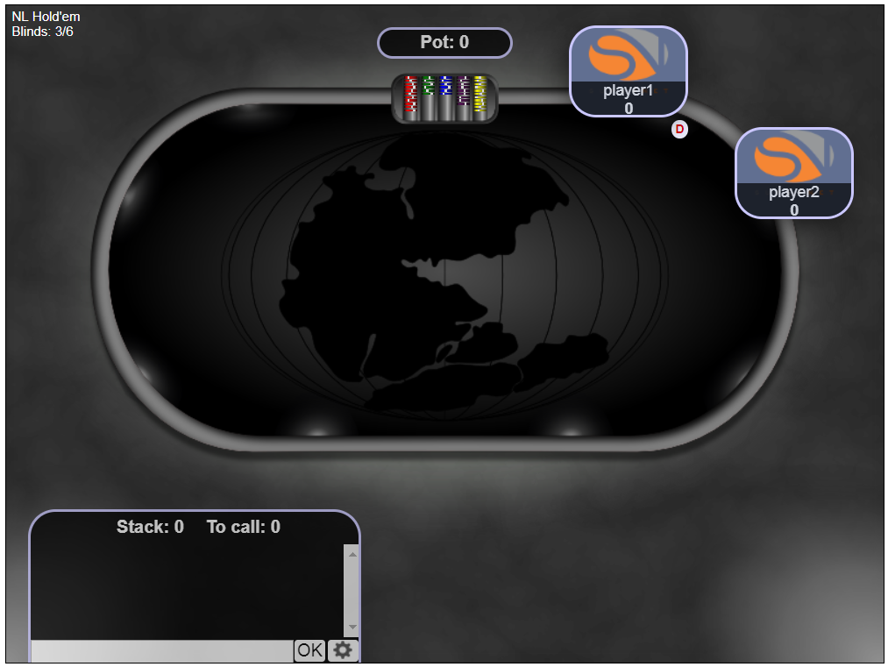

## Method : seats

Once the DCV rceives the game information, it request the information about the seats on the table. DCV sents the below JSON message to the backend to get the seat information
```json
{"method":"seats"}
```
The response from backend is shown below
```json
{
	"method":	"seats",
	"seats":	[{
			"name":	"player1",
			"seat":	0,
			"stack":	0,
			"empty":	0,
			"playing":	1
		}, {
			"name":	"player2",
			"seat":	1,
			"stack":	0,
			"empty":	0,
			"playing":	1
		}]
}
```
The significance of each field is mentioned as follows:
* __name__ : It referes to the name of the player, I hardcoded these values to **player1** and **player2**
* __seat__ : This value referes to the relative positioning of the player on the table. The front end GUI which `pangea-poker-frontend` has 
max table size of **9**.
* __stack__: This value refers to the amount of funds that each player is having at the begining of the game.
* __empty__: I didn't used this field abywhere in the frontend GUI, can be considered optional.
* __playing__: This field is used to make the seat available for playing, so tha any players can chose the seat with with value **1** and join the table.

In the GUI you can see the two seats which appear after the receiving of the seats information by DCV as shown in 
